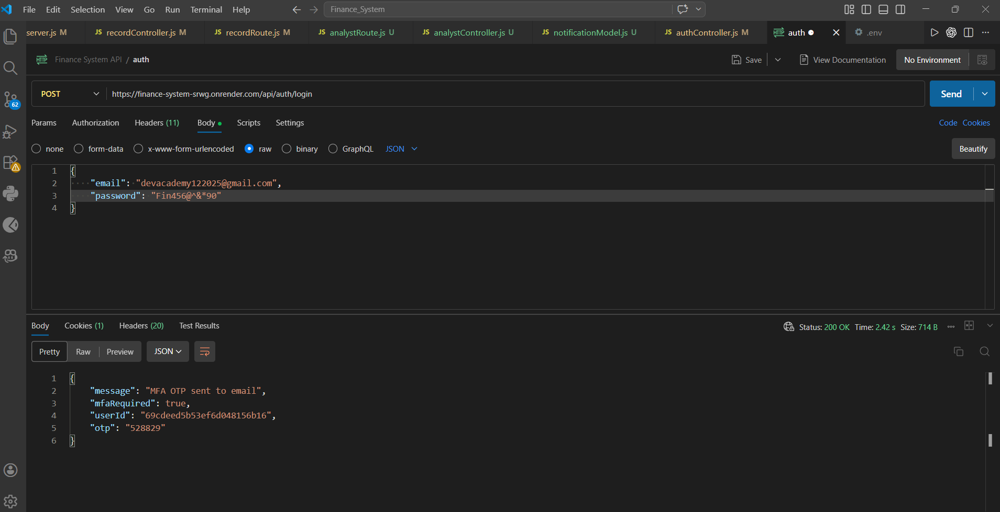
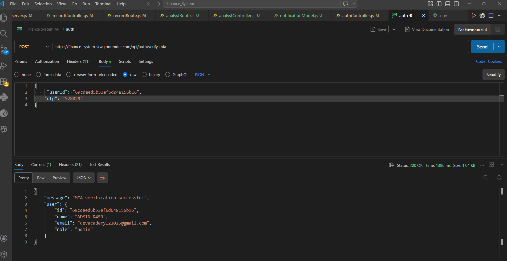
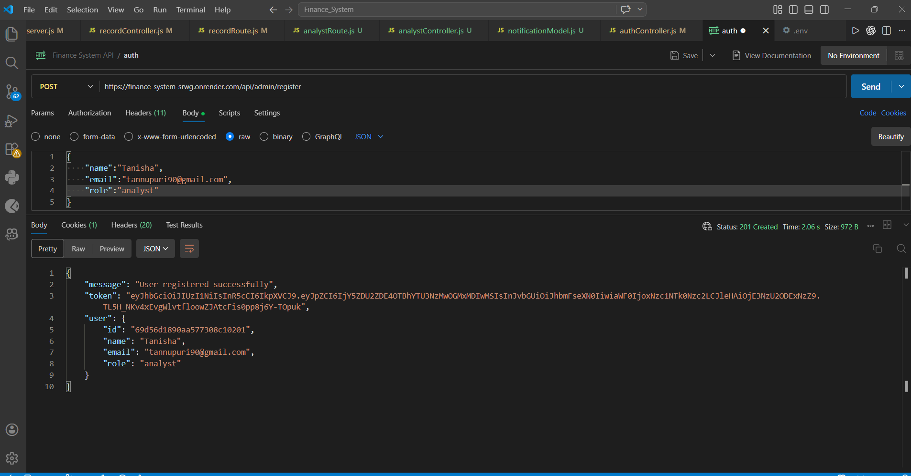
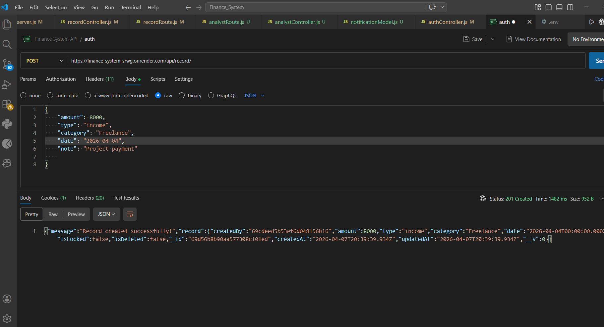
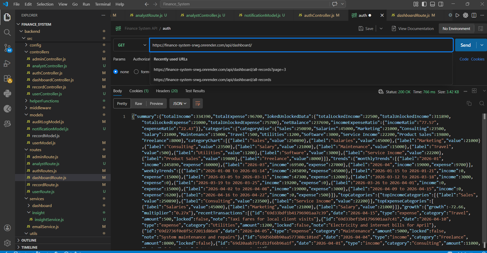
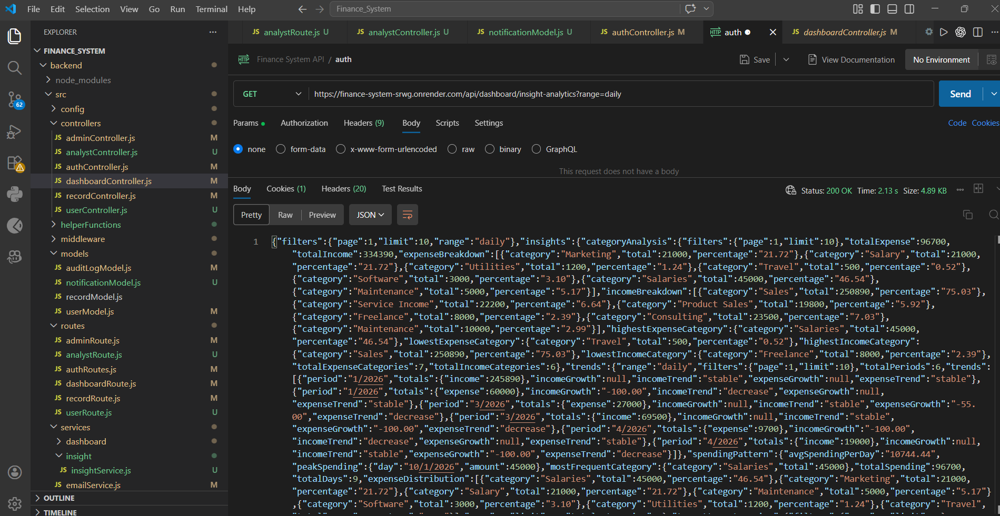

# 💰 Finance Dashboard Backend System

A scalable and secure backend system for managing financial data with **Role-Based Access Control (RBAC)**, **Multi-Factor Authentication (MFA)**, **automated reporting**, and **audit tracking**.

This project demonstrates real-world backend engineering practices including **data integrity, security, scheduling, and analytics processing**.

## 🌐 Live API
https://finance-system-srwg.onrender.com

---

## 🚀 Overview

The system enables different types of users (Admin, Analyst, Viewer) to interact with financial data based on their permissions. It focuses on:

* Secure authentication & authorization
* Financial data management
* Advanced analytics & insights
* Automated reporting via email
* Audit logging and monitoring

---

## 🛠️ Tech Stack

* **Backend:** Node.js, Express.js
* **Database:** MongoDB
* **Authentication:** JWT + MFA (OTP via Email)
* **Email Service:** Brevo
* **Scheduling:** Node Cron
* **Export:** exceljs, json2csv
* **Security:** express-rate-limit

---

## 👥 User Roles & Capabilities

### 🔴 Admin (Full Access)

#### User Management

* Create users and assign roles
* Sends email token (valid for 24 hours) for initial password setup
* View all users
* Deactivate users if any system violation is detected
* Deactivated users can:
  * Request account reactivation
* Admin can:
  * View all reactivation requests in Pending Activations
  * Review requests and activate users if valid
* Resend activation token if user fails to set password within 24 hours


#### Records Management

* Create financial records
* Update records
* Soft delete & restore records
* Lock records (prevents further modification → ensures **data integrity**)
* View all records including deleted ones

#### Monitoring & Control

* View all notifications
* Access **audit logs**
* Export audit logs in **CSV format**

#### Features

* Export insights & summary in **Excel**
  

#### MFA Security

* Login requires OTP verification via email

---

### 🔵 Analyst

#### Access

* Dashboard summary + advanced insights
* Financial analytics and reports

#### Features

* Export insights & summary in **Excel**
* Receives **automated reports (daily, weekly, monthly at 9 AM)**
* Reports available:

  * Email
  * Dashboard notifications (mark as read)

#### MFA Security

* Login requires OTP verification via email

---

### 🟢 Viewer

#### Access

* View dashboard summary
* View records and record details


---

## 🔐 Authentication & Security

* JWT-based authentication
* MFA (OTP via email) for Analyst & Admin
* Rate limiting to prevent abuse
* Account lock mechanism:

  * 5 failed attempts → account locked
  * Auto unlock after 24 hours (cron job)
* Email-based password setup (24-hour token validity)
* Email notification on account lock/unlock
* Can request admin for account reactivation
* Forgot password functionality

---

## 💰 Financial Records Management

* Create, update, delete (soft delete)
* Restore deleted records
* Record locking system:

  * Prevents modification after locking
  * Ensures data consistency and prevents corruption
* Filtering support:

  * Date
  * Category
  * Type (Income/Expense)
  * isLocked
  * Page
  * Limit
  * Search
    
---

## 📊 Dashboard Summary (Viewer, Analyst, Admin)

* Total Income
* Total Expenses
* Locked & Unlocked Income/Expenses
* Net Balance
* Income vs Expense Ratio
* Category-wise data
* Weekly & Monthly trends
* Top income/expense categories
* Growth metrics
* Recent transactions

---

## 📈 Advanced Insights (Analyst & Admin)

### 🔹 Category Analysis

* Total income & expenses
* Income/expense breakdown
* Highest & lowest categories

### 🔹 Unified Trends

* Income growth & trends
* Expense growth & trends

### 🔹 Spending Patterns

* Average spending per day
* Peak spending
* Most frequent category
* Expense distribution
* Total spending & active days

### 🔹 Top & Bottom Categories

* Income & expense comparison

### 🔹 Financial Health

* Total income & expenses
* Savings & savings rate
* Expense-to-income ratio
* Health status (chart data)


* Filtering support:

  * Range  
  * Page
  * Limit
  * StartDate
  * EndDate

---

## ⏰ Automated Reporting System

* Reports generated using **cron jobs**
* Sent at **9:00 AM**
* Frequency:

  * Daily
  * Weekly
  * Monthly

### Delivery Channels

* Email (Excel reports)
* Dashboard notifications

---

## 🔔 Notifications System

* Real-time notifications for:

  * Reports
 

* Analyst can:

  * View notifications
  * Mark as read

---

## 🧾 Audit Logging

Tracks all critical system activities:

* User actions
* Record operations
* System events

📤 Export supported in **CSV format**

---

## 📤 Export Features

* Excel export:

  * Dashboard summary
  * Insights

* CSV export:

  * Audit logs

---

## ⚙️ Cron Jobs

Automated background tasks:

* Send reports (daily/weekly/monthly at 9 AM)
* Unlock accounts after 24 hours
* Notify users about account unlock

---

## 📁 Project Structure

```
backend/
  src/
    config
    controllers/
    helperFunctions/
    middleware/
    models/
    routes/
    services/
    utils/

```

---

---

## 🔑 Test Credentials

> Use the following credentials to test different roles in the system.  
> (MFA enabled for Admin and Analyst — OTP will be sent to email)

### 🔴 Admin
- Email: devacademy122025@gmail.com,
- Password: Fin456@^&*90

### 🔵 Analyst
- Email: janhaviitankar2005@gmail.com,
- Password: Jan123@#vihee 

### 🟢 Viewer
- Email: itankarjanvi@gmail.com,
- Password: JANU@#$567vi

---

### ⚠️ Notes

- Analyst and Admin login requires **OTP verification (MFA)** via email  
- If email service is not accessible, please contact for OTP or use logs  
- Viewer does not require OTP  
- In case of account lock (after 5 failed attempts), it will auto-unlock after 24 hours  

---


## 📡 API Endpoints

🔐 Authentication APIs
| Method | Endpoint                    | Description                                     |
| ------ | --------------------------- | ----------------------------------------------- |
| POST   | `/api/auth/login`           | Login user (JWT + MFA for Admin/Analyst)        |
| POST   | `/api/auth/logout`          | Logout user                                     |
| POST   | `/api/auth/verify-mfa`      | Verify OTP for MFA                              |
| POST   | `/api/auth/forgot-password` | Send password reset email                       |
| POST   | `/api/auth/reset-password`  | Reset password using OTP                        |
| POST   | `/api/auth/set-password`    | Set password using activation token (via query) |


👥 User Management (Admin Only)
| Method | Endpoint                               | Description                                                                                  |
| ------ | -------------------------------------- | -------------------------------------------------------------------------------------------- |
| POST   | `/api/admin/register`                  | Create a new user and send **activation token via email (valid for 24 hrs)** to set password |
| GET    | `/api/admin/users`                     | Get all users                                                                                |
| POST   | `/api/admin/users/:id/deactivate`      | Deactivate user if any system violation is detected                                          |
| GET    | `/api/admin/users/pending-activations` | View users who have requested account reactivation                                           |
| POST   | `/api/admin/users/:id/activate`        | Reactivate user after verifying their request                                                |
| POST   | `/api/admin/users/:id/resend-reminder` | Resend activation email if user failed to set password within 24 hrs                         |


💰 Financial Records
| Method | Endpoint                  | Description                         | Access |
| ------ | ------------------------- | ----------------------------------- | ------ |
| GET    | `/api/record/`            | Get all records (filters supported) | All    |
| GET    | `/api/record/:id`         | Get record details                  | All    |
| POST   | `/api/record/`            | Create record                       | Admin  |
| PATCH  | `/api/record/:id`         | Update record                       | Admin  |
| DELETE | `/api/record/:id`         | Soft delete record                  | Admin  |
| PATCH  | `/api/record/:id/restore` | Restore deleted record              | Admin  |
| PATCH  | `/api/record/:id/lock`    | Lock record (prevent modification)  | Admin  |


📊 Dashboard APIs
| Method | Endpoint                           | Description           | Access         |
| ------ | ---------------------------------- | --------------------- | -------------- |
| GET    | `/api/dashboard/`                  | Get dashboard summary | All            |
| GET    | `/api/dashboard/insight-analytics` | Get advanced insights | Analyst, Admin |


📤 Export APIs
| Method | Endpoint                         | Description             | Access         |
| ------ | -------------------------------- | ----------------------- | -------------- |
| GET    | `/api/dashboard/export`          | Export summary (Excel)  | Analyst, Admin |
| GET    | `/api/dashboard/export-insights` | Export insights (Excel) | Analyst, Admin |
| GET    | `/api/admin/audit-logs/export`   | Export audit logs (CSV) | Admin          |


🔔 Notifications APIs
| Method | Endpoint                                   | Description                         | Access  |
| ------ | ------------------------------------------ | ----------------------------------- | ------- |
| GET    | `/api/analyst/notifications`               | Fetch all notifications for Analyst | Analyst |
| PATCH  | `/api/analyst/notifications/:id/mark-read` | Mark notification as read           | Analyst |
| GET    | `/api/admin/notifications`                 | Fetch all system notifications      | Admin   |


🧾 Audit Logs (Admin Only)
| Method | Endpoint                | Description        |
| ------ | ----------------------- | ------------------ |
| GET    | `/api/admin/audit-logs` | Get all audit logs |


---

## 📸 Screenshots

### 🔐 Login (JWT + MFA Trigger)
> User login response showing MFA requirement


---

### 🔑 Verify MFA (OTP Verification)
> OTP verification step for Admin/Analyst authentication


---

### 👥 Create User (Admin)
> Admin creating a new user with role assignment and email activation


---

### 💰 Create Financial Record
> Admin creating a new income/expense record


---

### 📊 Dashboard Summary
> Aggregated financial overview (income, expenses, trends, etc.)


---

### 📈 Advanced Insights
> Analytics including category analysis, spending patterns, and financial health


---


## 🌐 Deployment

* Hosted on **Render**


## 📌 Key Highlights

* ✅ Role-Based Access Control (RBAC)
* ✅ Multi-Factor Authentication (MFA)
* ✅ Record Locking (Data Integrity)
* ✅ Automated Reporting System
* ✅ Audit Logging & Monitoring
* ✅ Secure Account Management
* ✅ Scalable Backend Architecture

---

## 💡 Future Improvements

* Swagger API documentation
* Unit & integration testing
* Frontend dashboard integration

---

## 👩‍💻 Author

**Janhavi Itankar**

---

⭐ If you found this project useful, consider giving it a star!
